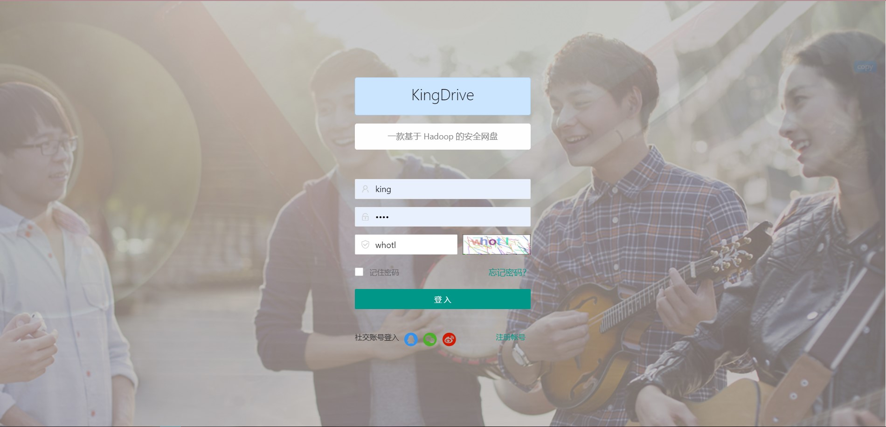
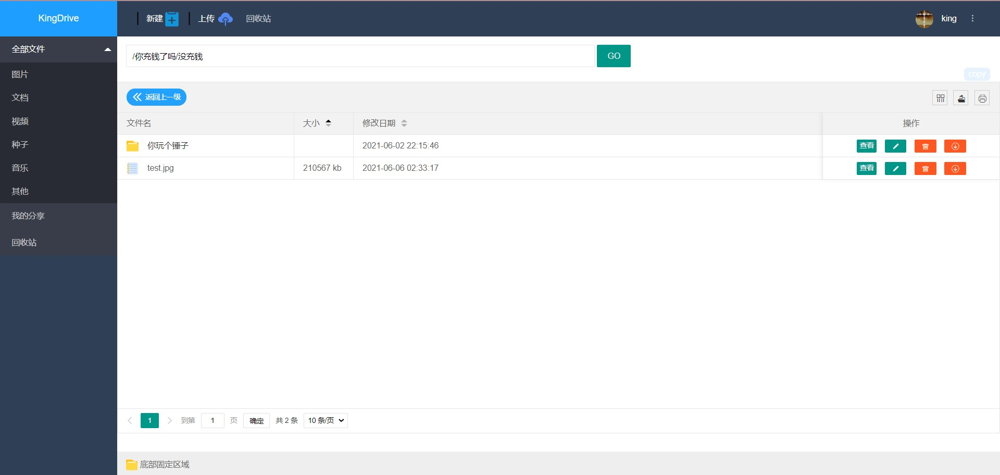
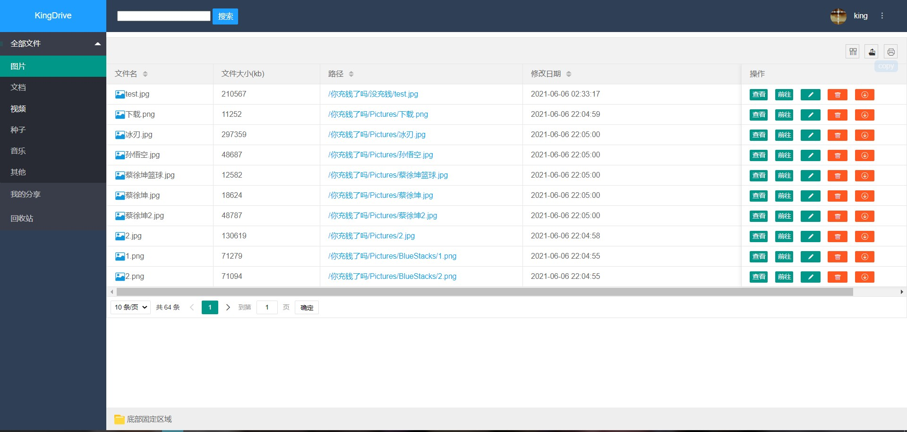

## 项目介绍

基于hadoop hdfs 编写的网盘项目

## 使用技术

### 前端

前端使用 layui 框架 使用了Vue Jquery a

### 前端

springboot + spring jpa + spring redis

## 完成的功能: 
用户登录
文件列表
文件上传
文件与文件夹下载 
重命名 
删除文件或文件夹 
新建文件 
部分文件预览

## 项目截图

