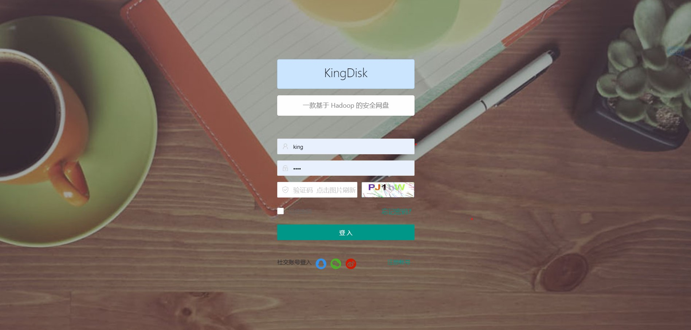

## 项目介绍

基于hadoop hdfs 编写的网盘项目

## 使用技术

### 前端

前端使用 Layui Vue Jquery axios

### 后端

springboot + spring jpa + spring redis + Hadoop hdfs的Java -API

## 完成的功能:

用户登录 文件列表 文件上传 文件与文件夹下载 重命名 删除文件或文件夹 新建文件 部分文件预览

## 项目截图

